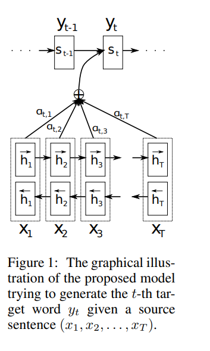

# Neural Machine Translation by Jointly Learning to Align and Translate

Authors: Dzmitry Bahdanau, Kyunghyun Cho, Yoshua Bengio
Comments: ICLR 2015
Date: March 2, 2022
File: files/NMT_attention.pdf
Link: https://arxiv.org/abs/1409.0473
Status: Reading
Tags: Attention Mechanism, NLP, Recurrent Neural Networks

### WHAT?

Neural Machine Translation Model using all hidden states of encoder state while decoding the output using a mechanism called Attention.

### WHY?

The fixed-sized context vector used in encoder-decoder architecture cannot encode all the information of long sequences.

### HOW?

- Using  all hidden states as input to calculate context vectors
- Calculating context vector based on the alignment scores, which gives information about how much similar the source word is to the previous output of the decoder
- The context vector is calculated as:

    $$
    C_i = \sum_{j=1}^{T_x}{\alpha_{ij} h_j}
    $$

    Where,

    $$
    \alpha_{ij} =\frac{exp(e_{ij})}{\sum_{k=1}^{T_x}{exp(e_{ik})}}
    $$

    and

    $$
    e_{ij} =  a(s_{i-1}, h_i)
    $$

    $s_{i-1}$ → Decoder output of the previous time step

    $h_j$ → Encoder output

    $$
    = v_a^T tanh(W_a s_{i-1} + U_a h_j)
    $$

    $v_a^T, W_a , U_a$ are weights of feedforward neural network.

- This extra layer is called attention layer, which finds where to focus more when translating the text.

### AND?

- Authors have use Bi-directional LSTMs to train all the models
- On training two models each of  attention architecture and encoder-decoder architecture, for 30 and 50 words long sequences both models with attention architecture performed better.

